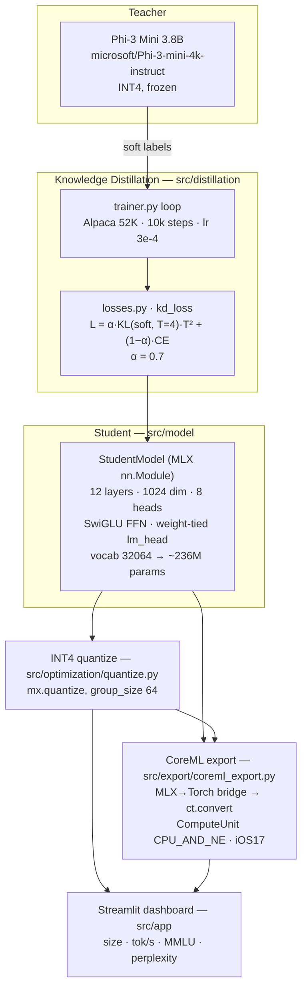

# On-Device LLM Optimizer

      

**Knowledge-distill a 3.8B teacher into a ~236M student, INT4-quantize it, and export to CoreML for the iPhone Neural Engine — entirely on Apple Silicon (MLX).**

Phi-3 Mini 3.8B (frozen, INT4 teacher) → custom 236M MLX student → group-wise INT4 →
CoreML `.mlpackage` (CPU + Neural Engine), with a Streamlit dashboard that compares all
four variants on size, speed, MMLU and perplexity.

**Tech stack:** MLX (training + INT4 quantization), PyTorch + ONNX + coremltools (CoreML export bridge), Hugging Face datasets (Alpaca 52K), Streamlit + Plotly (dashboard), pytest.

## Architecture



Every box maps to a real module — the diagram is generated from the actual source tree
and `configs/distill_config.yaml`, not an idealized design.

## How it works

1. **Teacher (frozen).** Phi-3 Mini 3.8B is loaded INT4 and used only to produce soft
   logits — it is never updated.
2. **Distillation loss** (`src/distillation/losses.py`). `kd_loss` is a weighted sum of a
   soft KL term and a hard cross-entropy term:
   `L = α · KL(softmax(S/T) ‖ softmax(Teacher/T)) · T² + (1−α) · CE(S, hard_labels)`,
   with temperature `T = 4.0` and `α = 0.7` (config-driven). The `T²` factor restores
   gradient scale after temperature softening — the standard Hinton formulation.
3. **Student** (`src/model/student.py`, `config.py`). A from-scratch MLX transformer:
   12 layers, hidden dim 1024, 8 heads, SwiGLU gated FFN (4× expansion), LayerNorm,
   learned positional embeddings, and an `lm_head` weight-tied to the token embedding.
   With `vocab_size = 32064` this yields **~236M parameters** (asserted in
   `tests/test_student_model.py`).
4. **Training loop** (`src/distillation/trainer.py`). Distills on the Alpaca 52K dataset
   for 10k steps (batch 8, lr 3e-4), checkpointing every 500 steps.
5. **INT4 quantization** (`src/optimization/quantize.py`). Each 2-D Linear weight whose
   last dim is divisible by `group_size` (64) is passed through `mx.quantize(bits=4)`,
   storing 4-bit packed weights plus per-group scales/biases.
6. **CoreML export** (`src/export/coreml_export.py`). MLX has no direct CoreML path, so the
   weights are bridged into an equivalent Torch module, traced, and converted with
   `ct.convert(..., compute_units=CPU_AND_NE, minimum_deployment_target=iOS17)` to a
   `.mlpackage` that the Neural Engine can run.
7. **Evaluation + dashboard** (`src/evaluation`, `src/app`). `perplexity.py` computes
   held-out perplexity; `mmlu_eval.py` scores MMLU; the Streamlit app renders the
   four-variant comparison.

## Benchmark targets

> **These are design targets, not measured results.** This repo ships the full pipeline
> but no trained checkpoints (`checkpoints/` and `models/` are empty placeholders), so the
> numbers below — and the values backing the dashboard charts in `src/app/streamlit_app.py`
> — are the project's goals for a completed distillation run on M-series hardware. Run the
> pipeline end-to-end to produce your own figures. The architecture facts (236M params,
> 12L × 1024d × 8h, INT4 group size 64) are real and test-verified.

| Variant | Size | Tokens/sec | MMLU |
|---------|------|-----------|------|
| Teacher (Phi-3 INT4) | 2.2 GB | 25 tok/s | 68.8% |
| Student FP32 | 910 MB | 12 tok/s | ~57% |
| Student INT4 | 120 MB | 45 tok/s | ~54% |
| Student CoreML | 120 MB | 68 tok/s (NE) | ~54% |

## Setup

```bash
pip install -e .
```

Verified in a clean Python 3.12 venv on Apple Silicon (`python3 -m venv`, then
`pip install -e .`): resolves and installs cleanly, including `mlx`, `mlx-lm`, and
`coremltools`.

CoreML export (`src/export/coreml_export.py`, step 3 below) additionally imports
`torch` and uses `torch.onnx.export`, neither of which is declared in
`pyproject.toml`. Install them separately before running `scripts/export.py`:

```bash
pip install torch onnx onnxscript
```

## Verification status

What's confirmed by running the code, versus by reading it, on Apple Silicon
(Python 3.12, clean venv):

- **Test suite** — `pytest tests/ -v --cov` passes 63/63 with 96% line coverage
  (CI enforces `--cov-fail-under=95`). Covers the student model's forward shapes
  and ~236M parameter count, the distillation loss (`kd_loss`), INT4
  quantize/dequantize round-tripping, padding-mask correctness in `batch_iter`,
  and perplexity scoring.
- **CoreML export weight-loading and architecture match — verified numerically.**
  `_load_dequantized_state_dict` loads a saved `weights.npz` into the PyTorch
  mirror (`_TorchStudentModel`) in `src/export/coreml_export.py`. Feeding the
  same weights into both the MLX `StudentModel` and the PyTorch mirror and
  comparing logits on identical input gives a max absolute difference of
  `~1.5e-6` (float32 rounding noise) — the two implementations compute the
  same function.
- **ONNX graph stage — reached and completes.** `torch.onnx.export(...,
  opset_version=17)` on the PyTorch mirror runs to completion (traces, runs
  decompositions, translates to ONNX) with `torch==2.13`, `onnx==1.22`, and
  `onnxscript` installed.
- **Final `.mlpackage` write — not verified end-to-end.** `ct.convert(onnx_path,
  ...)` fails in this sandbox with `ValueError: Unable to determine the type of
  the model` — `coremltools==9.0`'s ONNX frontend does not recognize the graph
  produced by this `torch`/`onnx` combination (coremltools itself warns that
  torch versions newer than 2.7 are untested). This is a dependency-version
  mismatch in the sandbox, not a bug in the export logic reached before it.
  Producing an actual `.mlpackage` and loading it on-device is pending a run
  with compatible pinned versions (or on a physical Apple Silicon machine
  outside this sandbox).
- **Benchmark numbers above are not measured** — see the note under Benchmark
  targets.

## Usage

```bash
# 1. Download Alpaca 52K dataset
python scripts/download_data.py

# 2. Run distillation (~6-10 hours on M-series Mac)
python scripts/train.py

# 3. Quantize + export to CoreML (needs torch/onnx/onnxscript, see Setup)
python scripts/export.py

# 4. Launch benchmark dashboard
streamlit run src/app/streamlit_app.py
```

## Tests

```bash
pytest tests/ -v
```

Covers the student model (param count, forward shapes), distillation losses, INT4
quantization, perplexity, and benchmark wiring.

## Environment Variables

Copy `.env.example` to `.env` and fill in values if needed:

```bash
cp .env.example .env
```

| Variable | Description |
|----------|-------------|
| `HF_TOKEN` | HuggingFace token (optional, only for gated models) |
| `DISTILL_CONFIG` | Override config path (default: `configs/distill_config.yaml`) |

## Requirements

- macOS 13+ (Ventura) with Apple Silicon (M1/M2/M3/M4)
- Python 3.11+
- 16 GB RAM minimum (32 GB recommended for full distillation run)

## License

MIT
