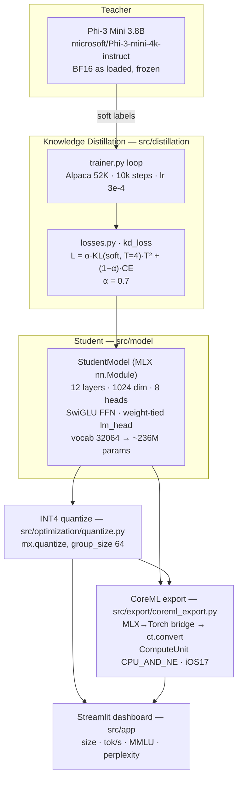

# On-Device LLM Optimizer

      

**Knowledge-distill a 3.8B teacher into a ~236M student, INT4-quantize it, and export to CoreML for the iPhone Neural Engine — entirely on Apple Silicon (MLX).**

Phi-3 Mini 3.8B (frozen teacher) → custom 236M MLX student → group-wise INT4 →
CoreML `.mlpackage` (CPU + Neural Engine), with a Streamlit dashboard that compares all
four variants on size, speed, MMLU and perplexity.

**Tech stack:** MLX (training + INT4 quantization), PyTorch + ONNX + coremltools (CoreML export bridge), Hugging Face datasets (Alpaca 52K), Streamlit + Plotly (dashboard), pytest.

## Architecture


```mermaid
flowchart TD
    subgraph Teacher
      T["Phi-3 Mini 3.8B<br/>microsoft/Phi-3-mini-4k-instruct<br/>BF16 as loaded, frozen"]
    end
    subgraph Distillation["Knowledge Distillation — src/distillation"]
      D["trainer.py loop<br/>Alpaca 52K · 10k steps · lr 3e-4"]
      L["losses.py · kd_loss<br/>L = α·KL(soft, T=4)·T² + (1−α)·CE<br/>α = 0.7"]
    end
    subgraph Student["Student — src/model"]
      S["StudentModel (MLX nn.Module)<br/>12 layers · 1024 dim · 8 heads<br/>SwiGLU FFN · weight-tied lm_head<br/>vocab 32064 → ~236M params"]
    end
    Q["INT4 quantize — src/optimization/quantize.py<br/>mx.quantize, group_size 64"]
    C["CoreML export — src/export/coreml_export.py<br/>MLX→Torch bridge → ct.convert<br/>ComputeUnit CPU_AND_NE · iOS17"]
    V["Streamlit dashboard — src/app<br/>size · tok/s · MMLU · perplexity"]

    T -->|soft labels| D
    D --> L
    L --> S
    S --> Q
    S --> C
    Q --> C
    Q --> V
    C --> V
```

Every box maps to a real module — the diagram is generated from the actual source tree
and `configs/distill_config.yaml`, not an idealized design.

## How it works

1. **Teacher (frozen).** Phi-3 Mini 3.8B is used only to produce soft logits — it is
   never updated. `trainer.py` loads the pinned Hugging Face checkpoint as published
   (BF16, 7.64 GB of safetensors); the `teacher.quantize: int4` key in the config is not
   read by any code, so the teacher is not quantized.
2. **Distillation loss** (`src/distillation/losses.py`). `kd_loss` is a weighted sum of a
   soft KL term and a hard cross-entropy term:
   `L = α · KL(softmax(S/T) ‖ softmax(Teacher/T)) · T² + (1−α) · CE(S, hard_labels)`,
   with temperature `T = 4.0` and `α = 0.7` (config-driven). The `T²` factor restores
   gradient scale after temperature softening, as in Hinton et al. Note the KL direction:
   this implementation computes KL(student ‖ teacher) (reverse KL, mode-seeking), whereas
   Hinton et al. use KL(teacher ‖ student) (forward KL).
3. **Student** (`src/model/student.py`, `config.py`). A from-scratch MLX transformer:
   12 layers, hidden dim 1024, 8 heads, SwiGLU gated FFN (4× expansion), LayerNorm,
   learned positional embeddings, and an `lm_head` weight-tied to the token embedding.
   With `vocab_size = 32064` this yields **~236M parameters** (asserted in
   `tests/test_student_model.py`).
4. **Training loop** (`src/distillation/trainer.py`). Distills on the Alpaca 52K dataset
   for 10k steps (batch 8, lr 3e-4), checkpointing every 500 steps.
5. **INT4 quantization** (`src/optimization/quantize.py`). Each 2-D weight whose last
   dim is divisible by `group_size` (64) — the Linear layers and the token and position
   embeddings — is passed through `mx.quantize(bits=4)`, storing 4-bit packed weights
   plus per-group FP32 scales/biases.
6. **CoreML export** (`src/export/coreml_export.py`). MLX has no direct CoreML path, so the
   weights are bridged into an equivalent Torch module, traced, and converted with
   `ct.convert(..., compute_units=CPU_AND_NE, minimum_deployment_target=iOS17)` to a
   `.mlpackage` that the Neural Engine can run.
7. **Evaluation + dashboard** (`src/evaluation`, `src/app`). `perplexity.py` computes
   held-out perplexity; `mmlu_eval.py` scores MMLU; the Streamlit app renders the
   four-variant comparison.

## Benchmark targets

> **Tokens/sec and MMLU are design targets, not measured results.** This repo ships the
> full pipeline but no trained checkpoints (`checkpoints/` and `models/` are empty
> placeholders), so those two columns — and the matching values backing the dashboard
> charts in `src/app/streamlit_app.py` — are the project's goals for a completed
> distillation run on M-series hardware. Run the pipeline end-to-end to produce your own
> figures. The architecture facts (236M params, 12L × 1024d × 8h, INT4 group size 64) are
> real and test-verified.
>
> **Sizes are measured.** File size is fixed by the architecture, not by training, so it
> can be measured without a trained checkpoint (see the note below the table).

| Variant | Size (measured) | Tokens/sec (target) | MMLU (target) |
|---------|------|-----------|------|
| Teacher (Phi-3 Mini, as loaded) | 7.64 GB (BF16) | 25 tok/s | 68.8% |
| Student FP32 | 945.3 MB | 12 tok/s | ~57% |
| Student INT4 | 147.9 MB | 45 tok/s | ~54% |
| Student CoreML | not measured | 68 tok/s (NE) | ~54% |

How the sizes were measured (MB = 10⁶ bytes):

- **Student FP32 / INT4** — build `StudentModel(StudentConfig())` (236,308,480 params,
  random init), save its parameters to `weights.npz` the way `trainer.py` does
  (`mx.savez` of `tree_flatten(model.parameters())`), then run the repo's own
  `quantize_int4(..., group_size=64)` on it and take the `weights.npz` file sizes:
  945,266,380 bytes FP32 and 147,942,532 bytes INT4. The INT4 file is 118.1 MB of packed
  4-bit weights + 29.5 MB of FP32 per-group scales/biases + 0.2 MB of unquantized
  vectors, so even the packed weights alone leave no room for the earlier 120 MB target
  at group size 64.
- **Teacher** — sum of the `.safetensors` files of `microsoft/Phi-3-mini-4k-instruct` at
  the revision pinned in `src/pins.py`, from the Hugging Face API. That is what
  `trainer.py` loads; it does not quantize the teacher.
- **CoreML** — not measured: the `.mlpackage` write is not verified end-to-end (see
  Verification status).

## Measured smoke run

The speed and MMLU targets above are unmeasured. To show the distillation path actually learns — on the repo's own
`StudentModel`, `kd_loss` and trainer — `scripts/kd_smoke.py` runs a small, real KD job and writes
`results/kd_smoke.json`. It is a smoke run, **not** the Phi-3 → 236M target: a 16.8M student
(4L × 256d × 4h), the open Apache-2.0 teacher `SmolLM2-135M`, 500 steps on Tiny Shakespeare
(public-domain), contiguous train/val split so no val text is trained on. Held-out perplexity, lower is better:

| Model | Val perplexity |
|---|---|
| Teacher (SmolLM2-135M) | 34.8 |
| Student, random init | 76061 |
| Student, **KD** (α=0.7, T=4) | **236.0** |
| Student, CE-only control (α=0) | 350.2 |

The KD student (236) beats the no-teacher CE-only control (350) under the same budget, so the teacher
signal measurably helps. One seed (0) on Apple Silicon (MLX 0.32.4). Reproduce with
`python scripts/kd_smoke.py`; its defaults are the committed configuration
(`--steps 500 --batch-size 8 --seq-len 128 --lr 1e-3 --seed 0`, as recorded in `results/kd_smoke.json`).
It needs about 20 minutes on an M-series Mac: the committed run spent 495 s and 579 s training
the two students, plus teacher scoring.
`tests/test_kd_smoke.py` checks the pieces on tiny tensors with no downloads.

## Setup

```bash
pip install -e ".[dev]"
```

The `dev` extra adds the test and lint tools (`pytest`, `pytest-cov`, `flake8`); plain
`pip install -e .` is enough to run the pipeline. Verified in a clean Python 3.12 venv on
Apple Silicon (`python3 -m venv`, then `pip install -e ".[dev]"`): resolves and installs
cleanly, including `mlx`, `mlx-lm`, and `coremltools`.

CoreML export (`src/export/coreml_export.py`, step 3 below) additionally imports
`torch` and uses `torch.onnx.export`, neither of which is declared in
`pyproject.toml`. Install them separately before running `scripts/export.py`:

```bash
pip install torch onnx onnxscript
```

## Verification status

What's confirmed by running the code, versus by reading it, on Apple Silicon
(Python 3.12, clean venv):

- **Test suite** — `pytest tests/ -v --cov=src` (after `pip install -e ".[dev]"`) passes 67/67
  with 45% line coverage of `src/` (`TOTAL 614 336 45%`). (A bare `--cov` reports 91%, but that only counts modules the tests import,
  including the test files themselves; the trainer, dashboard, MMLU eval and CoreML export
  are not exercised by tests.) CI does not enforce a coverage threshold: MLX does not
  install on the CI runner, so its test step is non-blocking. Covers the student model's forward shapes
  and ~236M parameter count, the distillation loss (`kd_loss`), INT4
  quantize/dequantize round-tripping, padding-mask correctness in `batch_iter`,
  and perplexity scoring.
- **CoreML export weight-loading and architecture match — verified numerically.**
  `_load_dequantized_state_dict` loads a saved `weights.npz` into the PyTorch
  mirror (`_TorchStudentModel`) in `src/export/coreml_export.py`. Feeding the
  same weights into both the MLX `StudentModel` and the PyTorch mirror and
  comparing logits on identical input gives a max absolute difference of
  `~1.5e-6` (float32 rounding noise) — the two implementations compute the
  same function.
- **ONNX graph stage — reached and completes.** `torch.onnx.export(...,
  opset_version=17)` on the PyTorch mirror runs to completion (traces, runs
  decompositions, translates to ONNX) with `torch==2.13`, `onnx==1.22`, and
  `onnxscript` installed.
- **Final `.mlpackage` write — not verified end-to-end.** `ct.convert(onnx_path,
  ...)` fails in this sandbox with `ValueError: Unable to determine the type of
  the model` — `coremltools==9.0`'s ONNX frontend does not recognize the graph
  produced by this `torch`/`onnx` combination (coremltools itself warns that
  torch versions newer than 2.7 are untested). This is a dependency-version
  mismatch in the sandbox, not a bug in the export logic reached before it.
  Producing an actual `.mlpackage` and loading it on-device is pending a run
  with compatible pinned versions (or on a physical Apple Silicon machine
  outside this sandbox).
- **Speed and MMLU numbers above are not measured** — see the note under Benchmark
  targets. The sizes in that table are measured.

## Usage

```bash
# 1. Download Alpaca 52K dataset
python scripts/download_data.py

# 2. Run distillation (~6-10 hours on M-series Mac)
python scripts/train.py

# 3. Quantize + export to CoreML (needs torch/onnx/onnxscript, see Setup)
python scripts/export.py

# 4. Launch benchmark dashboard
streamlit run src/app/streamlit_app.py
```

## Tests

```bash
pytest tests/ -v
```

Covers the student model (param count, forward shapes), distillation losses, INT4
quantization, perplexity, and benchmark wiring.

## Environment Variables

Copy `.env.example` to `.env` and fill in values if needed:

```bash
cp .env.example .env
```

| Variable | Description |
|----------|-------------|
| `HF_TOKEN` | HuggingFace token (optional, only for gated models) |
| `DISTILL_CONFIG` | Override config path (default: `configs/distill_config.yaml`) |

## Requirements

- macOS 13+ (Ventura) with Apple Silicon (M1/M2/M3/M4)
- Python 3.11+
- 16 GB RAM minimum (32 GB recommended for full distillation run)

## License

MIT
